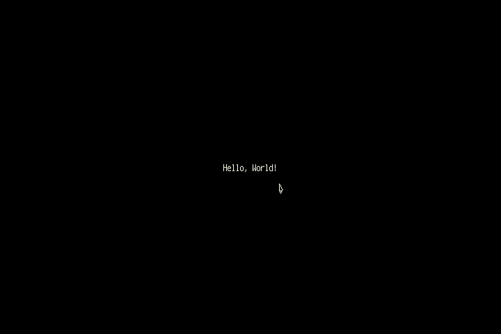

# [Fruit Jam Pong Tutorial](.#sections): 1. Bootstrap

I'll be honest, I got tired of writing the same code over and over again. Plus, I wanted a place to compile the most up-to-date bare essentials for a well-written Fruit Jam application. Thus, [Fruit_Jam_Application](https://github.com/relic-se/Fruit_Jam_Application) was born! This template repository serves as a place to quickly start up your own code repository and support the following goodies:

- Display and audio configuration with Fruit Jam OS launcher config support
- USB Host mouse and keyboard support
- Multi-tasking with `asyncio` _(not required, but recommended)_
- Fruit Jam OS metadata and icon
- Project Bundle build script with GitHub Build CI and Release workflows

Plus, I threw in a little "Hello, World!" to make sure everything is working.

## Using the Bootstrap Template

To use this public template repository, you will need to fork it onto your own GitHub account. If you don't have one... [make one!](https://github.com/signup) By forking this repository into your account, it essentially makes it available (in its current state) within your account when you create a new repository. And if I ever make major changes to the template, you can update your forked repository by using the "Sync Changes" feature within GitHub.

Now, you can create a new repository for your application using the template ([more info](https://docs.github.com/en/repositories/creating-and-managing-repositories/creating-a-repository-from-a-template)). Make sure to name your repository something like "Fruit_Jam_..." to make it clear that it's a Fruit Jam compatible program. In my case, I used "Fruit_Jam_Pong".

Alternatively, you can download the latest version of the template available [here](https://github.com/relic-se/Fruit_Jam_Application/releases) and build on top of it on your local machine. This may actually be recommended if your just getting started and aren't ready to start using git repositories.

## Preparing Your Application

### README

If you are using GitHub to create your application, the first thing people will see when checking out your code is the `README.md` file ([more info](https://docs.github.com/en/repositories/managing-your-repositorys-settings-and-features/customizing-your-repository/about-readmes)). It's pretty important that it has the correct information on it. So, let's get started by opening that file and changing the title and description to better match your program.

### Metadata

In a similar vein, the metadata for [Fruit Jam OS](https://github.com/adafruit/Fruit-Jam-OS) is stored within `metadata.json`. You'll want to open this file up in your code editor and change the `"title"` value to your application's name, in my case "Pong".

It will also display the icon for the application according to the `icon.bmp` file which supports a resolution of 64x64 pixels. Feel free to edit this to your hearts desire to display how you would like within the Fruit Jam OS launcher.

### Install dependencies

The base bootstrap application does require a handful of libraries to help it manage hardware resources among other things. In order to get them installed, we will need `circup`, a super handy tool for managing Adafruit and Community CircuitPython libraries on your device. Follow [this guide](https://learn.adafruit.com/keep-your-circuitpython-libraries-on-devices-up-to-date-with-circup) to get it set up on your computer.

Once you've done that and ensured that your Fruit Jam is connected and mounted to your computer, you should be able to navigate to the path of your code files within your terminal and run the following command:

``` bash
circup install -r requirements.txt
```

This will install the following library dependencies to your device:

- `adafruit_display_text` - Writes text to the display
- `adafruit_fruitjam` - Manages Fruit Jam hardware and configures display output
- `adafruit_pathlib` - File path calculations _(not too important, but it helps us load libraries when installed within Fruit Jam OS)_
- `adafruit_usb_host_mouse` - Driver for USB Boot-compatible Mouse with `displayio` support
- `asyncio` - Cooperative multi-tasking _(very helpful when managing program logic and USB devices)_

By the time we're done, we'll be adding a few more libraries to this list, but this is enough to get us started.

### Run `code.py`

Ready to get your Fruit Jam running? All you need to for now is copy over the `code.py` into your `CIRCUITPY` drive and replace the existing file. If all goes well, you should see "Hello, World!" in the center of your display and if you plug in a USB mouse, a mouse cursor should display which you can move around. Nothing too special, but pretty cool nonetheless!



> If you're using Thonny, you can also evaluate the code directly by copying and pasting it into the file editor or opening the existing `code.py` file and hitting the "Run current script" button. You'll also be able to see the serial debug output over REPL.

### Auto-Reload

We also have a file called `boot.py`. You may have noticed that your device automatically reloaded when `code.py` was replaced. This is called "auto-reload" where CircuitPython automagically determines when to restart your code file based on USB operations.

Depending on your host computer and a number of other variables, this might just get in the way. If you start to notice that your program just randomly restarts from time to time, you may have to turn auto-reload off! The provided `boot.py` file runs once on start up and disables this feature. Just copy it over to your device and perform a hard reset (either hitting the reset button or switch the power switch on and off) for it to start working.

However, if you plan to manage updates to your code either by editing the file in place on your computer or copying it over, you'll want to ignore this step and keep auto-reload on.

## Final Code

Although we didn't do too much to it, your code should now look something like this:

``` python
# load included modules if we aren't installed on the root path
if len(__file__.split("/")[:-1]) > 1:
    import adafruit_pathlib as pathlib
    if (modules_directory := pathlib.Path("/".join(__file__.split("/")[:-1])) / "lib").exists():
        import sys
        sys.path.append(str(modules_directory.absolute()))

import asyncio
import displayio
import sys
import supervisor
from terminalio import FONT

from adafruit_display_text.label import Label
import adafruit_fruitjam.peripherals
import adafruit_usb_host_mouse

# get Fruit Jam OS config if available
try:
    import launcher_config
    config = launcher_config.LauncherConfig()
except ImportError:
    config = None

# setup display
displayio.release_displays()
try:
    adafruit_fruitjam.peripherals.request_display_config()  # user display configuration
except ValueError:  # invalid user config or no user config provided
    adafruit_fruitjam.peripherals.request_display_config(720, 400)  # default display size
display = supervisor.runtime.display

# setup audio, buttons, and neopixels
peripherals = adafruit_fruitjam.peripherals.Peripherals(
    safe_volume_limit=(config.audio_volume_override_danger if config is not None else 12),
)

# user-defined audio output and volume
if config is not None:
    peripherals.audio_output = config.audio_output
    peripherals.volume = config.audio_volume
else:
    peripherals.audio_output = "headphone"
    peripherals.volume = 12

# create root group
root_group = displayio.Group()
display.root_group = root_group

# example text
root_group.append(Label(
    font=FONT, text="Hello, World!",
    anchor_point=(.5, .5),
    anchored_position=(display.width//2, display.height//2),
))

# mouse control
async def mouse_task() -> None:
    while True:
        if (mouse := adafruit_usb_host_mouse.find_and_init_boot_mouse("bitmaps/cursor.bmp")) is not None:
            mouse.x = display.width // 2
            mouse.y = display.height // 2
            root_group.append(mouse.tilegrid)

            timeouts = 0
            previous_pressed_btns = []
            while timeouts < 9999:
                pressed_btns = mouse.update()
                if pressed_btns is None:
                    timeouts += 1
                else:
                    timeouts = 0
                    if "left" in pressed_btns and (previous_pressed_btns is None or "left" not in previous_pressed_btns):
                        pass
                previous_pressed_btns = pressed_btns
                await asyncio.sleep(1/30)
            root_group.remove(mouse.tilegrid)
        await asyncio.sleep(1)

async def keyboard_task() -> None:
    # flush input buffer
    while supervisor.runtime.serial_bytes_available:
        sys.stdin.read(1)

    while True:
        while (c := supervisor.runtime.serial_bytes_available) > 0:
            key = sys.stdin.read(c)
            if key == "\x1b":  # escape
                peripherals.deinit()
                supervisor.reload()
        await asyncio.sleep(1/30)

async def main() -> None:
    await asyncio.gather(
        asyncio.create_task(mouse_task()),
        asyncio.create_task(keyboard_task()),
    )

try:
    asyncio.run(main())
except KeyboardInterrupt:
    peripherals.deinit()
```

> [guide/1_bootstrap.py](./guide/1_bootstrap.py)

## Next Steps

Enough of this bootstrap nonsense. Let's get to writing code! [Move forward to the next section, Graphics!](./README-2-Graphics.md)
