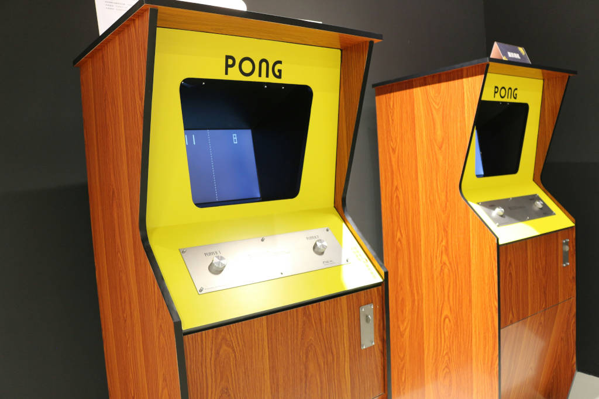
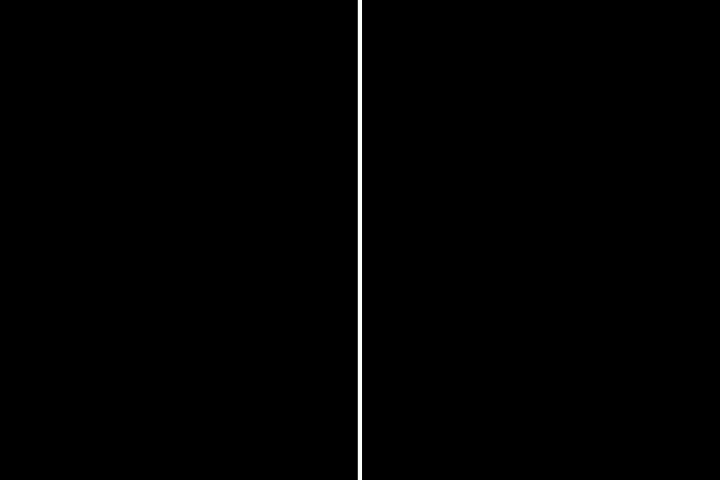
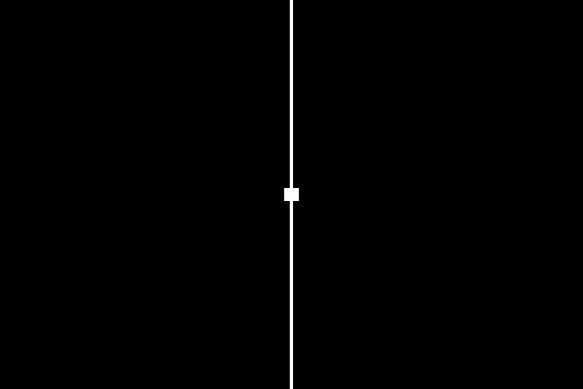
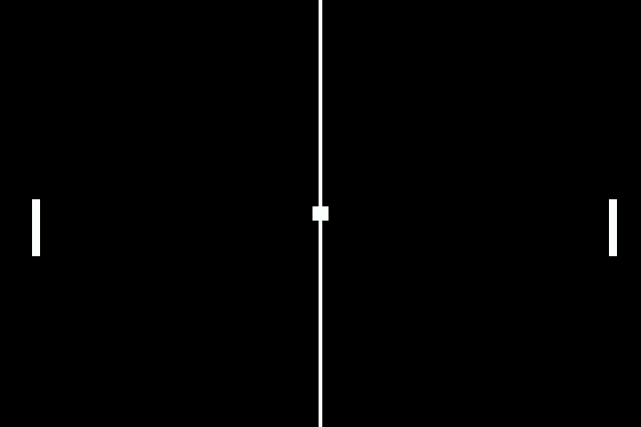
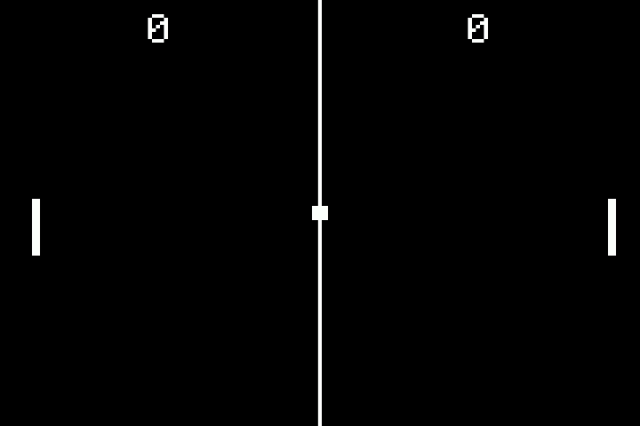

# [Fruit Jam Pong Tutorial](.#sections): 2. Graphics

Now we've got everything ready to go, let's start with the best part, creating the graphics! It may seem counter-intuitive, but sometimes for simple games like this, it can help to lay things out on the display first and control them second.

## Original Arcade Cabinet

In our case, we want to replicate the original Atari Pong arcade console. Well, not exactly. We are not expecting a one-to-one emulation here. Instead, we want to replicate the gameplay mechanics, look, and overall feel of the original game.

> Full emulation is definitely possible, but it will likely take much deeper research and programming with minimal gains, imo.



The graphics of the original game game be summed up as the following elements:

- Monochrome (full black or full white)
- Center line (or net)
- Left and right player paddles
- Pong ball
- Left and right scores (0 to 11)

## Bootstrap Clean-up

Although the bootstrap code features some niceties, we're actually going to need to clean it up to focus in on our game's functionality.

### User Display Resolution Support

In order to keep things simple, we're going to restrict our program to a single display resolution. This will make it so we don't have to worry about scaling visual and gameplay elements up. We're also going to want to use a lower resolution with a 4:3 aspect ratio (very retro).

So, we're going to replace all of the lines under `# setup display` with:

``` python
# setup display
adafruit_fruitjam.peripherals.request_display_config(320, 240)
display = supervisor.runtime.display
```

> You may have noticed that I removed `displayio.release_displays()` here. For this particular application, I found it unnecessary, but you may want to add it back in depending on your use-case.

### Example Text

Yeah, we aren't going to need that "Hello, World!" any longer. However, make sure to study how it handles adding a `adafruit_display_text.label.Label` object! So, go ahead and take out everything under the `# example text` area.

### Mouse Cursor

Although we'll be supporting mouse input, the original game definitely did not display a mouse cursor on screen. So, let's go ahead and take out the lines relating to the `mouse.tilegrid`. While we're at it, we're not going to be using the x position of the mouse, so remove the line that centers that too. _(Keep the y position centering!)_

## Palette

The color palette of this game is going to **very** simple. Just black and white, right? Still, we're going to need to create a `displayio.Palette` object for all of our display objects to reference. The following code should take care of the job:

``` python
# generate simple foreground palette
foreground_palette = displayio.Palette(1)
foreground_palette[0] = 0xffffff
```

In case you're not familiar, color values in CircuitPython use a 24-bit integer format with red, green, and blue components divided as 8-8-8 bits _(0xrrggbb in hexadecimal)_. In the above code, the value `0xffffff` corresponds to white since all components are at full brightness. If you know anything about web colors, this should be pretty familiar to you.

## Drawing Shapes

Since the graphics of this game are very simple being mostly rectangles, instead of using bitmap graphics, we're going to use primitive shapes. CircuitPython has a built-in module just for this, `vectorio`. Although it can generate more complicated shapes including circles and polygons, we're going to focus in on `vectorio.Rectangle` specifically.

We need to start by including our module in our `code.py` file. Add the following line to the list of imports at the top:

``` python
import vectorio
```

### Center Line

The center line will just serve as a simple decorative object and will therefore be pretty simple. We're going to create a `vectorio.Rectangle` object, assign it to our palette, place it in the center, and give it the full height with a little bit of width (or "stroke"), in our case 2 pixels.

``` python
# center line
root_group.append(vectorio.Rectangle(
    pixel_shader=foreground_palette,
    width=2, height=display.height,
    x=display.width//2-1, y=0,
))
```

> You'll notice I'm using `//` in order to divide the display width by half. There is a very important reason for this! A normal division operator, `/`, will result in a float (decimal) value rather than an integer (whole number) value. Although our display width is `320`, it will actually output as `160.0`.
> 
> Not really a big deal **except** that `displayio` objects don't like floats! It will raise a `ValueError` exception if you do this. Instead, using `//` performs an integer division operation which will always result in an integer value, ie: `160`. You'll see me using this a lot throughout this program when dealing with display elements.

If you run the program, you should see the following output:



### Ball

Let's keep the ball rolling, literally! Our pong ball will be another `vectorio.Rectangle` that is 8x8 pixels in size. I guess this ball wouldn't roll very easily since it's square and all, but we've got to keep the authentic pong experience!

``` python
# ball
ball = vectorio.Rectangle(
    pixel_shader=foreground_palette,
    width=8, height=8,
    x=display.width//2-4, y=display.height//2-4,
)
root_group.append(ball)
```

This snippet is very similar to the one above except that I'm centering our ball both on the x and y axis. Also, you'll notice that I'm keeping a variable reference to this object. That's because we are definitely going to want to refer to it later on when we control these graphics of ours.

The program should now look like this:



### Paddles

For the player paddles, we're going to get just a little more fancy with our code. I figured that a size of 4x32 felt good here and a margin of 16 pixels from the sides felt good. Because we need two paddles, one for each side, I used a simple for loop to give us an index value that increments from 0 to 1. The only effect this has is with the x position of the paddle which changes from the left to the right side of the screen with a simple inline conditional.

``` python
# paddles
paddles = []
for i in range(2):
    paddle = vectorio.Rectangle(
        pixel_shader=foreground_palette,
        width=4, height=32,
        x=(display.width-20 if i else 16),
        y=display.height//2-8,
    )
    root_group.append(paddle)
    paddles.append(paddle)
```

You may notice that the x position is a little different depending on the side (20 vs 16). That's because the position of a `vectorio.Rectangle` object is anchored at the top-left of the rectangle. So, on the right side we have to account for the extra 4 pixels of the width of the paddle.

If you run your code, it will look something like this:



## Score Labels

Now that we've taken care of all the basic shapes, we need to add in the labels for each players' score. We'll be using the `adafruit_display_text.label.Label` class ([documentation](https://docs.circuitpython.org/projects/display_text/en/latest/api.html#adafruit_display_text.label.Label)) to handle this which will look very similar to how we displayed "Hello, World!" in the bootstrap code.

``` python
# labels
score_labels = []
for i in range(2):
    # add score
    label = Label(
        font=FONT, text="0", color=foreground_palette[0], scale=2,
        anchor_point=(.5, 0), anchored_position=(display.width*(1+i*2)//4, 4),
    )
    root_group.append(label)
    score_labels.append(label)
```

Once again, we're using a loop to generate the two labels with `i=0` and `i=1` to designate between the players. You'll notice that we're taping into our palette to assign the desired foreground color (white) to the text. We're also using `scale=2` to double the size of our text.

As for the anchored position, there's a great example [within the documentation](https://docs.circuitpython.org/projects/display_text/en/latest/examples.html#anchored-position) that shows how this feature works. In our case, we're aligned the top of the text along the top of the display with a margin of 4 pixels and then centering on the x axis along the 1/4th and 3/4th vertical guidelines.

We'll be using the text value of these labels to store the user's integer score. For now, we'll just set it as `"0"` to get us started.

> If you want to play around with it, you can change the `foreground_palette[0]` value to be any color you'd like, which should affect all visual elements of the game.

Wow, it's starting to look a good bit like Pong, isn't it!



## Final Code

Your code should now look something like this:
> [guide/2_graphics.py](./guide/2_graphics.py)

## Next Steps

We've got our program looking pretty good, but it's a bit stale. Let's work on reading user input and controlling our visual elements. [Let's move on to controls!](./README-3-Controls.md)
