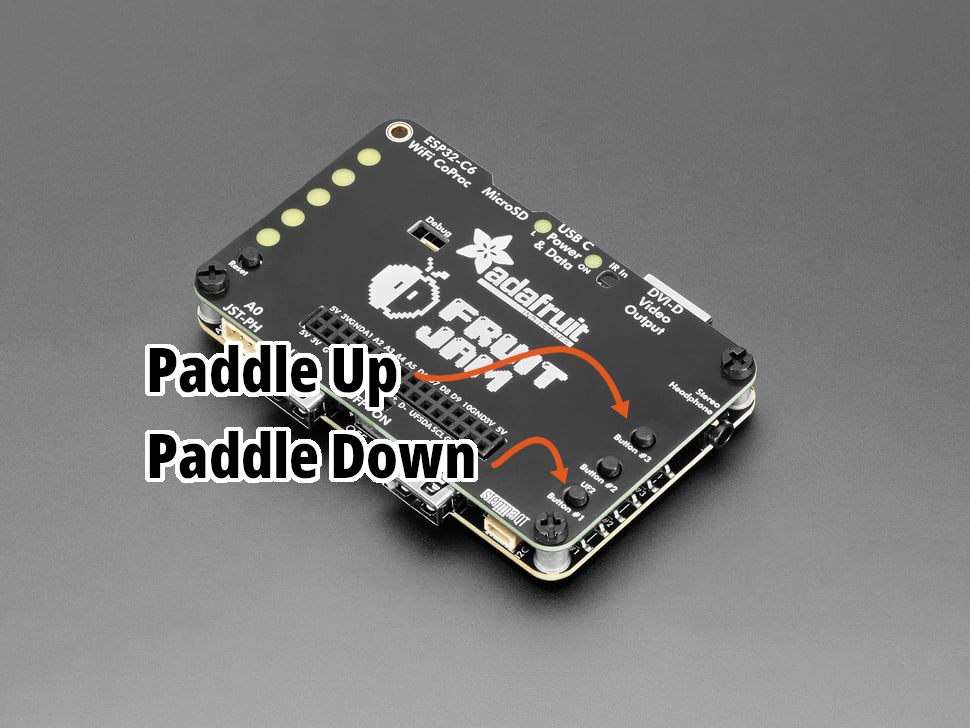
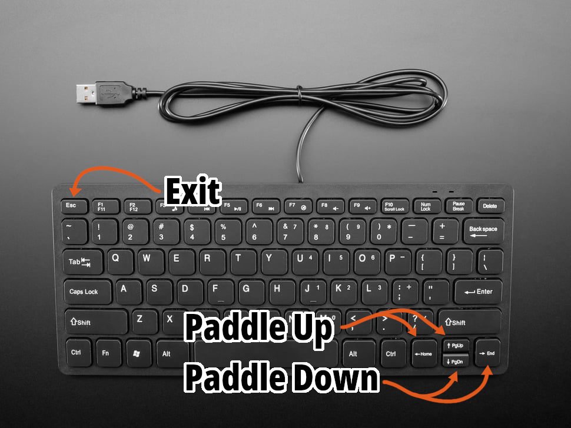
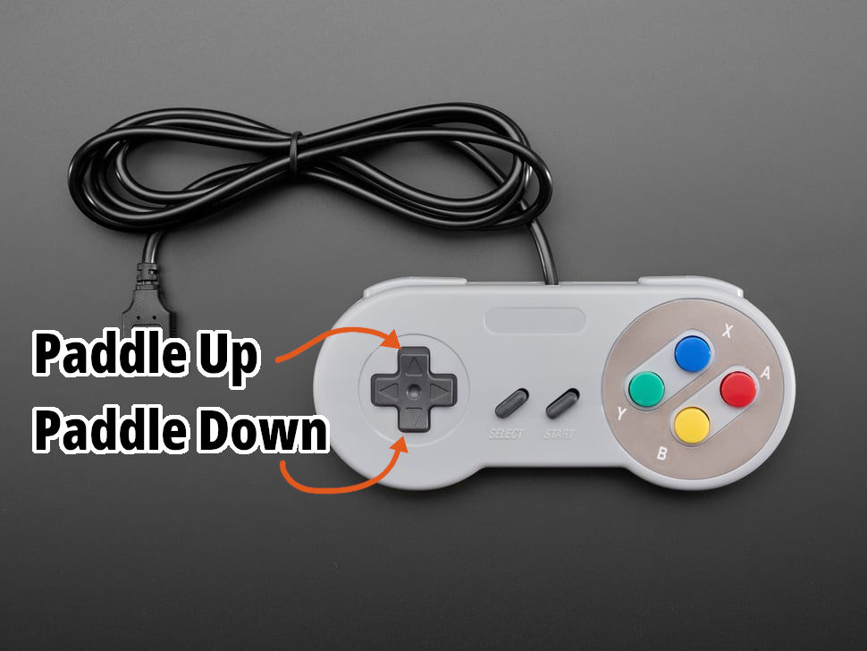
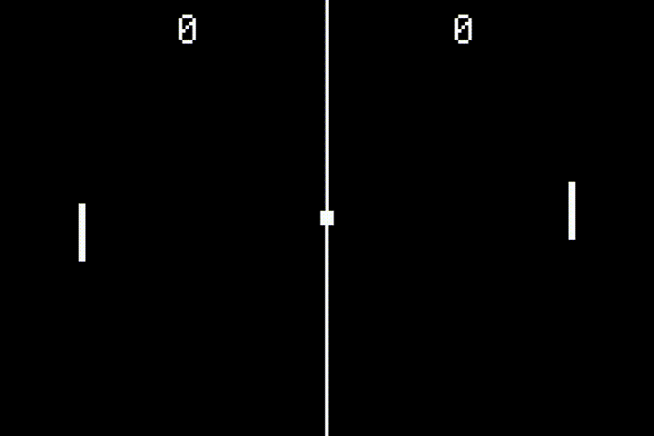

# [Fruit Jam Pong Tutorial](.#sections): 3. Controls

For most games on the Fruit Jam, it's a good idea to support as many input combinations as you can, because you never know how users are going to prefer to interact with your application. For Pong, we're going to support 4 different input sources: Keyboard, Mouse, Gamepad, and the buttons on the Fruit Jam itself.

> Unfortunately, I don't know of a way to support some sort of "paddle-style" controller input like on the Atari 2600. I think the way we'll be implementing mouse control gets us pretty close, but if anyone has a good reference to a USB paddle controller or how to support original 2600 controllers, let me know!

## Paddle Movement

The focus of this topic is going to be on controlling the player paddles. To start with, we're going to need to add a program constant value to determine the speed of our paddles on the y axis.

Go ahead and the following to the top of your program:

``` python
# program constants
PADDLE_SPEED = 6
```

The `PADDLE_SPEED` constant is set as 6 pixels per frame. After some testing, I felt like that was a good number to work with here.

Next step is to use this value to control our paddle objects. You'll need to add the following after we initial all display elements:

``` python
# paddle movement method
def paddle_move(direction: int, player: int = 0) -> None:
    direction = 1 if direction > 0 else -1  # restrict direction to 1 or -1
    y = paddles[player].y  # create temporary copy of y position
    y -= direction * PADDLE_SPEED  # apply movement
    y = min(max(y, 0), display.height - paddle.height)  # clamp the position to the playfield
    paddles[player].y = y  # update rectangle position
```

The method is relatively simple. We're just taking in two arguments, one to distinguish the vertical direction, 1 is up and -1 is down _(yes, I know this isn't ideal, but it will match our control scheme)_, and the other to select the desired player, 0 is left and 1 is right.

From there, we create a temporary copy of the current y value, modify it by our paddle speed, and "clamp" the value to the limits of the display. Once we've done all that, we can update our paddle object with the new position.

> You may notice that we're not actively calling for a display refresh. This is because by default, `displayio` displays have `auto_refresh` turned on which automatically updates the display in the background if any objects have changed.
>
> For larger applications, this can cause partial display updates and graphical anomalies. So, you'll want to turn this feature off (`display.auto_refresh = False`) and manually call `display.refresh()` within your gameplay loop.
>
> Because pong only features simple display objects, I felt that this wasn't necessary, and the auto refresh feature works well enough for us.

## Input Devices

Now that we have a shared method to control our paddles, let's provide the user with a way to do so!

### Buttons

The simplest control interface is going to be the built-in hardware buttons on the Fruit Jam, #1 through #3. In order to begin reading the state of these buttons, we're going to want to create a new `asyncio` task:

``` python
async def buttons_task() -> None:
    while True:
        # ...
        await asyncio.sleep(1/30)
```

Now that we have a loop that will update at our desired rate (30 times a second), we can add it to our main loop:

``` python
async def main() -> None:
    await asyncio.gather(
        asyncio.create_task(mouse_task()),
        asyncio.create_task(keyboard_task()),
        asyncio.create_task(buttons_task()),  # buttons task added!
    )
```

All good... but we're not doing anything! Remember how I said that the `adafruit_fruitjam.peripherals.Peripherals` class is going to be doing all of the leg work for hardware resources? Well, we need to tap into that resource once again.

We have 3 properties to work with here: `peripherals.button1`, `peripherals.button2`, and `peripherals.button3` ([more info](https://docs.circuitpython.org/projects/fruitjam/en/latest/api.html#adafruit_fruitjam.peripherals.Peripherals.button1)). These are simple `bool` properties which will read the hardware buttons and tell us if they're pressed, `True`, or released, `False`.

So, let's go ahead and add some logic using these buttons:

``` python
async def buttons_task() -> None:
    while True:
        if peripherals.button3:  # up
            paddle_move(1)
        elif peripherals.button1:  # down
            paddle_move(-1)
        if peripherals.button1 and peripherals.button2 and peripherals.button3:  # all buttons = exit
            peripherals.deinit()
            supervisor.reload()
        await asyncio.sleep(1/30)
```

Pretty simple stuff. If we're pressing Button #3 (the top one), we'll move the left paddle up (the player argument defaults to `0`). If we're pressing Button #1 (the bottom one), we'll move the left paddle down. And if all three buttons are pressed at once, we'll go ahead and exit the application.



> At the moment, we're not using `peripherals.button2` for any specific action, but that will change later on.

If you run the program now, you should be able to move the left paddle around! But let's not stop there...

### Keyboard

Let's go back to our keyboard control task loop.

``` python
async def keyboard_task() -> None:
    # flush input buffer
    while supervisor.runtime.serial_bytes_available:
        sys.stdin.read(1)

    while True:
        while (c := supervisor.runtime.serial_bytes_available) > 0:
            key = sys.stdin.read(c)
            if key == "\x1b[A" or key == "\x1b[D":  # up or left
                paddle_move(1)
            elif key == "\x1b[B" or key == "\x1b[C":  # down or right
                paddle_move(-1)
            elif key == "\x1b":  # escape
                peripherals.deinit()
                supervisor.reload()
        await asyncio.sleep(1/30)
```

For now, we'll just be using the arrow keys to control our left paddle. The arrow keys use a value that is very similar to the escape key, but also have `[` and a character from "A" to "B" to indicate that a certain special key was pressed.

Because we're reading the entire `sys.stdin` buffer at once, we can just test for the full code of each key using the following table:

| Value    | Key         |
|----------|-------------|
| `\x1b[A` | Up Arrow    |
| `\x1b[B` | Down Arrow  |
| `\x1b[C` | Right Arrow |
| `\x1b[D` | Left Arrow  |



> Want to support two player control on one keyboard? Why not change the control scheme around a bit. Maybe "W" and "S" for the left paddle and "I" and "K" for the right paddle?
>
> **Hot Tip:** When testing for single key alphabetic characters, you'll want to force the value to be uppercase, `key = sys.stdin.read(c).upper()`. Otherwise, you'll get two different values for one character, ie: "w" and "W".

### Mouse

We're going to do things a little differently for mouse input. Normally, the mouse controls a cursor on the screen. Why not make that "cursor" the left paddle itself? The only difference is that we'll be restricting movement to the y axis.

Our mouse task loop should look something like the following:

``` python
# mouse control
async def mouse_task() -> None:
    while True:
        if (mouse := adafruit_usb_host_mouse.find_and_init_boot_mouse("bitmaps/cursor.bmp")) is not None:
            mouse.y = display.height // 2

            timeouts = 0
            previous_pressed_btns = []
            while timeouts < 9999:
                pressed_btns = mouse.update()

                # restrict mouse x position to paddle
                mouse.x = paddles[0].x + paddles[0].width // 2

                # limit mouse y position
                if mouse.y < paddles[0].height // 2:
                    mouse.y = paddles[0].height // 2
                elif mouse.y > display.height - paddles[0].height // 2:
                    mouse.y = display.height - paddles[0].height // 2
                
                # assign mouse position to paddle
                paddles[0].y = mouse.y - paddles[0].height // 2

                if pressed_btns is None:
                    timeouts += 1
                else:
                    timeouts = 0
                    if "left" in pressed_btns and (previous_pressed_btns is None or "left" not in previous_pressed_btns):
                        pass
                previous_pressed_btns = pressed_btns
                await asyncio.sleep(1/30)
        await asyncio.sleep(1)
```

> Need a refresher on the `adafruit_usb_host_mouse.BootMouse` class? [Check out the documentation.](https://docs.circuitpython.org/projects/usb_host_mouse/en/latest/api.html#adafruit_usb_host_mouse.BootMouse)

We're going to start out by restricting the mouse position to values that we can work with. So, no x movement at all _(not that it will make a huge difference)_.

``` python
# restrict mouse x position to paddle
mouse.x = paddles[0].x + paddles[0].width // 2
```

Also, we need to keep it within the y axis of the display with a bit of margin to account for the size of the paddle itself.

``` python
# limit mouse y position
if mouse.y < paddles[0].height // 2:
    mouse.y = paddles[0].height // 2
elif mouse.y > display.height - paddles[0].height // 2:
    mouse.y = display.height - paddles[0].height // 2
```

After that, all we need to do is update the left paddle position's y value and adjust for the paddle size.

``` python
# assign mouse position to paddle
paddles[0].y = mouse.y - paddles[0].height // 2
```

Go ahead, run the code and plug in a (hopefully working) mouse and watch her go!

> We are not restricting paddle movement to `PADDLE_SPEED` when using input from the mouse. So, there is technically a competitive advantage to using mouse input versus other input methods... but that's fine!

### Gamepad

Now here is where the real fun begins. All the other input methods, they're good and all, but they don't feel like a game console! I'm betting you have a few game controllers laying around: Xbox, PlayStation, Switch, etc. Well, don't you worry, we can make good use of them!

We'll be using the `relic_usb_host_gamepad` library ([more info](https://circuitpython-usb-host-gamepad.readthedocs.io/en/latest/)) to connect with any one of these devices. _(Sorry, no wireless support!)_ This library will basically take care of everything for us and add an abstraction layer so that we don't have to worry about different types of gamepad devices.

#### Installing Library

In order to get started, we're going to need to install this library to our device and add it as a requirement of our project. Run the following command in your terminal with your device connected to install it to your Fruit Jam:

``` bash
circup install relic_usb_host_gamepad
```

While we're at it, let's update the `requirements.txt` with this library as well. It's always good practice to keep your `requirements.txt` updated as you install or remove dependencies from your application to make it easier for others to get your program running and to include the library in your build files. So, just add `relic_usb_host_gamepad` as a new line in the file.

The last step is going to be to import the module to your program. Go to the top of your `code.py` file and add the following to the list of modules being imported:

``` python
import relic_usb_host_gamepad
```

#### Initialize Gamepads

Our program is going to support up to two gamepad devices for two-player control using the left and right USB ports on the front of the Fruit Jam which will coordinate to the left and right paddles. Luckily, the `relic_usb_host_gamepad` library supports just this!

If you take a look at [the documentation](https://circuitpython-usb-host-gamepad.readthedocs.io/en/latest/api.html#relic_usb_host_gamepad.Gamepad), you'll notice that the `relic_usb_host_gamepad.Gamepad` class constructor takes a `port` argument. If left unset (with a value of `None` or `0`), it will search for a gamepad on any USB port and initialize it as "player 1" (depending on your controller, it may display this on the onboard LEDs). Instead, if you this value to 1 or 2, it will restrict its device search to only that corresponding port and will define the controller player value as such.

This means that if you plug the controller on the left side, you will be player 1, and if you plug the controller in on the right side, you will be player 2 just like the classic consoles. Neato!

So, lets get started by initializing both gamepads using an iterable list constructor:

``` python
# initialize left and right player gamepads
gamepads = [relic_usb_host_gamepad.Gamepad(port=i+1) for i in range(2)]
```

#### Setup Gamepad Task

We now have two gamepad objects, but they won't do anything if we don't poll them. Let's create a new `asyncio` task:

``` python
async def gamepad_task() -> None:
    while True:
        for i, gamepad in enumerate(gamepads):
            if gamepad.update():
                pass  # this is where our logic will go
        await asyncio.sleep(1/30 if any(gamepad.connected for gamepad in gamepads) else 1)  # sleep longer if there are no gamepads connected
```

And don't forget to add it to the main loop!

``` python
async def main() -> None:
    await asyncio.gather(
        asyncio.create_task(mouse_task()),
        asyncio.create_task(keyboard_task()),
        asyncio.create_task(buttons_task()),
        asyncio.create_task(gamepad_task()),  # added here
    )
```

Here, we are are polling the gamepad devices by using `gamepad.update()` on each of the two gamepads. You'll also notice that we're using `enumerate(...)` to get both an index (0 or 1) and the gamepad object. We'll use this for determining which paddle to update later on. For our `asyncio.sleep(...)` call, we're updating the loop 30 times a second unless no controllers are connected in which we slow things down to once per second.

> For USB devices, it's generally good to perform the device searching process less often because it can sometimes take a lot of time and processing to find all USB devices, and it just isn't necessary.

Reading the state of a `Gamepad` object to see if certain buttons are pressed is pretty easy using the `relic_usb_host_gamepad.Gamepad.buttons` property. Within our loop if the `gamepad.update()` method ran correctly _(the controller state was updated)_, let's add the following code:

``` python
if gamepad.buttons.UP or gamepad.buttons.JOYSTICK_UP:  # up
    paddle_move(1, player=i)
elif gamepad.buttons.DOWN or gamepad.buttons.JOYSTICK_DOWN:  # down
    paddle_move(-1, player=i)
if gamepad.buttons.HOME:  # home
    peripherals.deinit()
    supervisor.reload()
```

This is going to look pretty similar to our hardware buttons loop. We're just checking if `UP` or `DOWN` on the d-pad was pressed to control the paddle. Notice that we're using our enumerator index to define the `player` argument? We're also checking to see if `HOME` was pressed which is used to restart the device.

In addition to the d-pad, we're also using `JOYSTICK_UP` and `JOYSTICK_DOWN`. The `Gamepad` object automatically reads joystick inputs and translates them into simple directional boolean values if they surpass a given threshold _(I believe it's 50%?)_. More options = more better!



Plug in a supported controller over USB and try it out for yourself. Try switching between left and right USB ports to control their corresponding paddles. Cool stuff!

> To see every supported button input as well as analog inputs (joysticks and triggers), I recommend reviewing [the library documentation](https://circuitpython-usb-host-gamepad.readthedocs.io/en/latest/api.html#relic_usb_host_gamepad.Buttons).

## Final Code

That was a doozy, but your code should now look something like this:
> [guide/3_controls.py](./guide/3_controls.py)



## Next Steps

Now that we're able to move our paddles around, I think it's about time that we get that ball moving! [Let's move on to Ball Movement.](./README-4-Ball-Movement.md)
