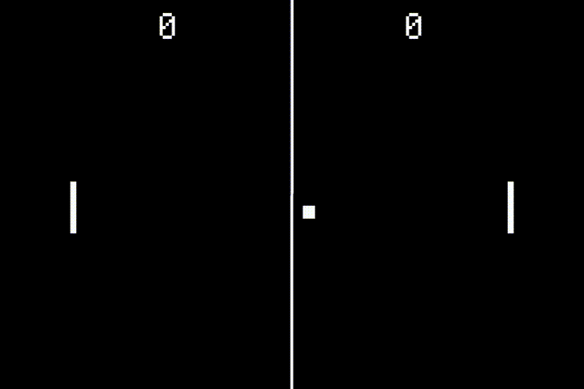
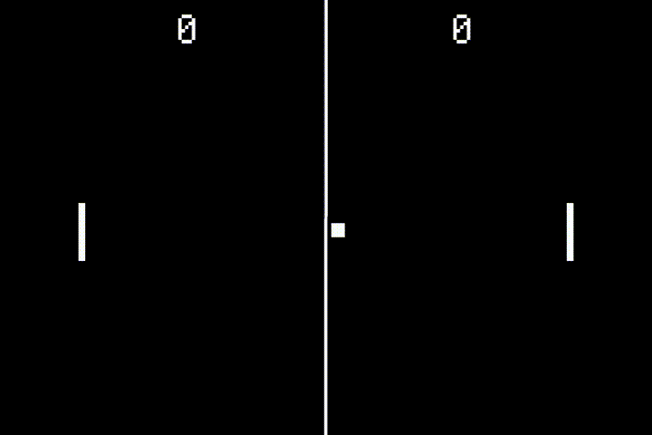
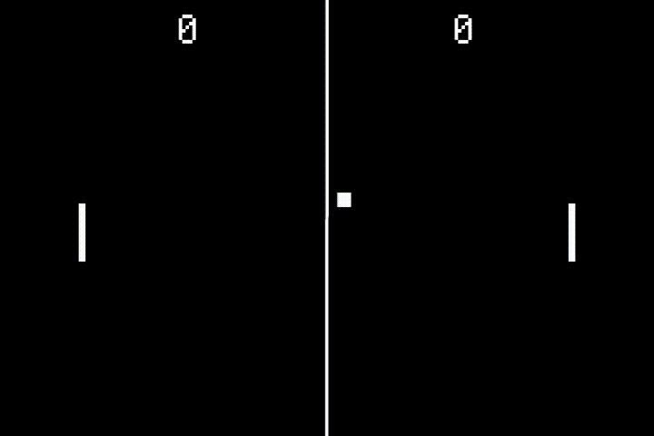
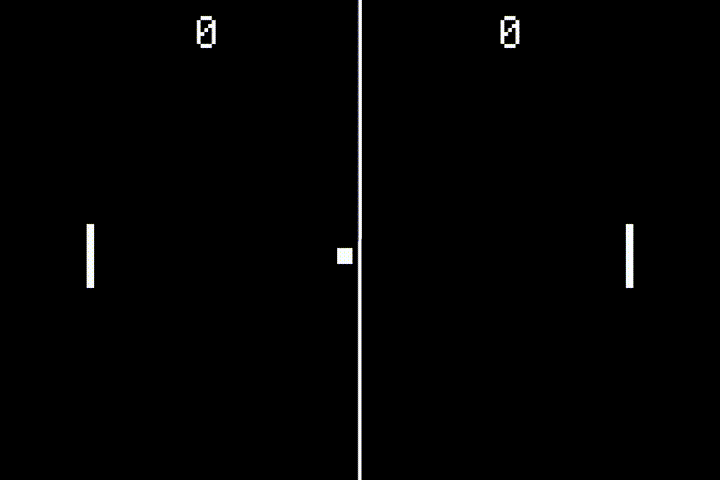

# [Fruit Jam Pong Tutorial](.#sections): 4. Ball Movement

It isn't much of a pong game if the pong ball doesn't move! We'll be fixing that in this section.

## Constants

Once again, we're going to need a program constant to define the speed of our ball. Add the following to the top of your `code.py` file:

``` python
# program constants
PADDLE_SPEED = 6
BALL_SPEED = 1  # added
```

We're keeping it simple for now making the ball only move 1 pixel at a time diagonally _(which will technically be `sqrt(2)` pixels per frame)_.

## Gameplay Task

Once again, we're going to need to add another task to the list. This task will be handling all of our general gameplay processes. Start by creating the task method, updating at a rate of 30 times a second:

``` python
async def gameplay_task() -> None:
    while True:
        # ...
        await asyncio.sleep(1/30)
```

And then add that task to the main loop

``` python
async def main() -> None:
    await asyncio.gather(
        asyncio.create_task(mouse_task()),
        asyncio.create_task(keyboard_task()),
        asyncio.create_task(gamepad_task()),
        asyncio.create_task(buttons_task()),
        asyncio.create_task(gameplay_task()),  # added
    )
```

## Velocity

At the moment, we're just going to keep the velocity of the ball constant. Let's create two local variables to store this velocity, `velocity_x` and `velocity_y` and update the ball x and y position every frame:

``` python
async def gameplay_task() -> None:
    velocity_x, velocity_y = 1, 1
    while True:

        # apply velocity to ball position
        ball.x += velocity_x * BALL_SPEED
        ball.y += velocity_y * BALL_SPEED

        await asyncio.sleep(1/30)
```


## Wall Bouncing

If you run the program now, you should notice that the ball just goes down and to the right and then disappears forever! That's not good, but we can fix that. After applying the velocity to the ball, we're going to be doing some basic logic checks to see if we need to "bounce" the ball on the top and bottom walls. In order to do this "bounce", all we need to do is invert the velocity by multiplying it by -1.

``` python
# only check if we've hit the bottom if y velocity is positive and if we've hit the top if y velocity is negative
if (velocity_y < 0 and ball.y <= 0) or (velocity_y > 0 and ball.y + ball.height >= display.height):
    velocity_y *= -1  # invert y velocity
```

> **Hot Tip:** One trick here is that we're first checking the direction of the velocity before testing the ball position. This is very helpful to keep us from running into a situation where the ball gets stuck on one wall, constantly inverting its velocity every frame. Once we're done testing in one direction, we move on to start testing in the next direction and don't change until we bounce.



## Paddle Collision

That's good and all, but if you run the program, you'll notice that the ball bounces once and then we're still going off screen to the right! Well, we don't actually want the ball to bounce on the right wall, because that would indicate that the game is over and a player scores a point. Instead, we want to check if the ball collided against a paddle in order to bounce it back in the other direction.

In order to do this, the first thing we'll need is a method to check for collision between two `vectorio.Rectangle` objects, and I have just the trick:

``` python
def collides(a: vectorio.Rectangle, b: vectorio.Rectangle) -> bool:
    # if one rectangle is to the right of the other
    if a.x > b.x + b.width or b.x > a.x + a.width:
        return False
    # if one rectangle is above the other
    if a.y > b.y + b.height or b.y > a.y + a.height:
        return False
    # rectangles must intersect
    return True
```

This may look a little complicated, but we're just checking if the top left or bottom right points of each rectangle are outside of the bounds of the other. If so, we know the rectangles don't intersect. Otherwise, they must!

Now, let's put this method into practice:

``` python
# see if we've collided with a paddle
if (velocity_x < 0 and collides(ball, paddles[0])) or (velocity_x > 0 and collides(ball, paddles[1])):
    velocity_x *= -1  # invert x velocity
```

> Once again, see how we're testing the direction of the x velocity of the ball? This should improve both performance and reliability.

Simple stuff, if we hit either paddle, we just change our ball x velocity. Now, if you run the program, you've got yourself a sort-of working game of Pong! But you'll probably run into the next problem: once you miss and the ball goes off screen, it ain't coming back.


## Out of Bounds

What we need to do is also check if the ball has gone out of bounds and then reset the ball to start the process all over again.

``` python
# check if we've gone out of bounds
if (velocity_x < 0 and ball.x + ball.width < 0) or (velocity_x > 0 and ball.x >= display.width):

    # delay before showing ball again and continuing
    await asyncio.sleep(1)

    # reset ball position to center
    ball.x = (display.width - ball.width) // 2
    ball.y = (display.height - ball.height) // 2
```

After our quick test against `ball.x` to check if its off screen, we're going to through in a second of delay before resetting. This will hopefully give our player(s) some time to rest before getting back into the action.

> By the way, this is one of the benefits of using `asyncio`. You can hit the snooze button on any task at any point and the rest of the operations will keep on chugging until your task is back up to bat. You'll notice that during this sleep we can still control the paddles using any input method.

After that, we want to recenter the ball and continue the gameplay loop.



## Randomize Velocity

This is cool and all, but having the ball start in the same direction it last was heading is a bit too predictable. Let's create a method to randomize both the starting velocity and when the ball resets. In order to do this, we're going to need to built-in `random` core module ([documentation](https://docs.circuitpython.org/en/latest/shared-bindings/random/index.html#module-random)).

Go ahead and include it in your program by adding the following line to the top:

``` python
import random
```

Now, just like `collides(...)`, we're going to making a method to handle this for us:

``` python
def get_random_velocity() -> tuple:  # returns (-1 or 1, -1 or 1)
    return (
        random.randint(0, 1) * 2 - 1,  # either -1 or 1
        random.randint(0, 1) * 2 - 1
    )
```

That will return a tuple of two integers, each of which are either 1 or -1. Perfect!

Going back to our gameplay loop, let's put this in practice. Replace our initial velocity assignment with the following:

``` python
velocity_x, velocity_y = get_random_velocity()  # start with random velocity
```

And then randomize the velocity again during our ball reset.

``` python
# check if we've gone out of bounds
if (velocity_x < 0 and ball.x + ball.width < 0) or (velocity_x > 0 and ball.x >= display.width):

    # delay before showing ball again and continuing
    await asyncio.sleep(1)

    # reset ball position to center
    ball.x = (display.width - ball.width) // 2
    ball.y = (display.height - ball.height) // 2

    # randomize velocity
    velocity_x, velocity_y = get_random_velocity()
```

Awesome! You can basically play pong now. All that's missing is keeping score!



## Ball Visibility

Okay, just one little clean up task here. In order to avoid potential display issues, it's a good idea to control the visibility of the ball when it spawns in and goes off screen. This isn't completely necessary, but it will come into good use later on.

Let's start the ball off in the hidden state when we first initialize it:

``` python
# ball
ball = vectorio.Rectangle(
    pixel_shader=foreground_palette,
    width=8, height=8,
    x=display.width//2-4, y=display.height//2-4,
)
ball.hidden = True  # start out hidden
root_group.append(ball)
```

Then, right at the beginning of the gameplay task, let's make it visible:

``` python
async def gameplay_task() -> None:
    # show the ball
    ball.hidden = False

    # ...
```

And one final update to our reset loop, lets hide the ball right before the reset delay and then show it again after we've repositioned it and randomized the velocity:

``` python
# check if we've gone out of bounds
if (velocity_x < 0 and ball.x + ball.width < 0) or (velocity_x > 0 and ball.x >= display.width):

    # hide ball
    ball.hidden = True

    # delay before showing ball again and continuing
    await asyncio.sleep(1)

    # reset ball position to center
    ball.x = (display.width - ball.width) // 2
    ball.y = (display.height - ball.height) // 2

    # randomize velocity
    velocity_x, velocity_y = get_random_velocity()

    # show the ball
    ball.hidden = False
```



## Final Code

That just about sums it up. Your pong game is well on its way. Everything after this is just icing on the cake.

After all of that, your code should now look something like this:
> [guide/4_ball-movement.py](./guide/4_ball-movement.py)

## Next Steps

I know I mentioned it before, but we are missing a core tenant of any game... scoring! [Let's move on to the Scoring section of this tutorial.](./README-5-Scoring.md)
