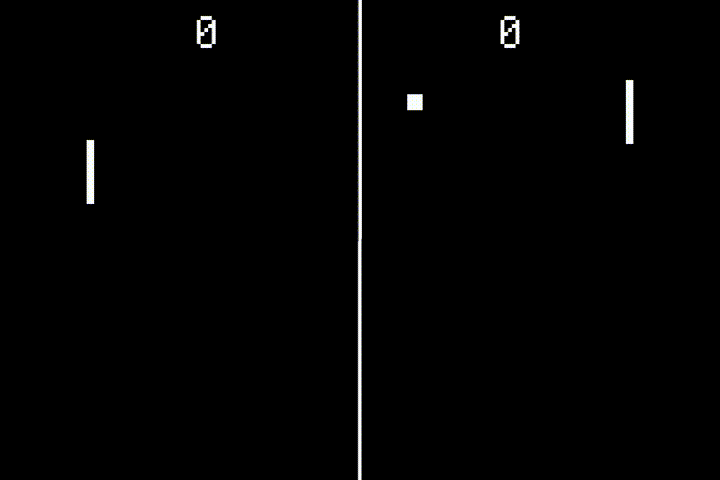
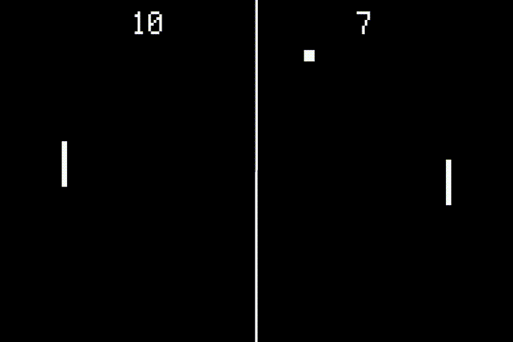
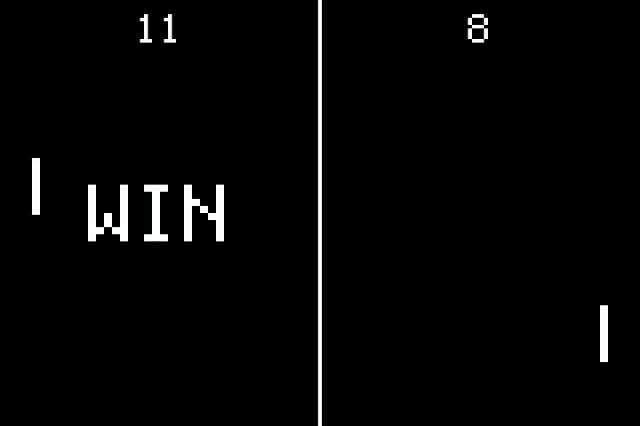

# [Fruit Jam Pong Tutorial](.#sections): 5. Scoring

I wouldn't exactly call myself an expert when it comes to how ping pong scoring works, but here's the gist of the rules that I'm surmised:

1. You get 1 point for winning each round
2. In order to win, you must have at least 11 points
3. You must also win by at least 2 points over the other player

I'm fairly certain that the original Pong game did not feature #3, but we're going to follow these rules anyway. So, technically the final score of a game could be something like 15-13 or more if the two players are evenly matched.

## Constants

Now that we have an idea of how score should be implemented, let's start by adding the base constants to our program.

``` python
# program constants
PADDLE_SPEED = 6
BALL_SPEED = 1
WIN_SCORE = 11  # added
WIN_DIFF = 2  # added
```

We now have two new constants:

- `WIN_SCORE` - The minimum required score to win
- `WIN_DIFF` - The minimum difference in score between the winning and losing player to win

## Increment Player Score

Let's go back to our gameplay loop and look for where the ball goes out of bounds, indicating the the opposing player has won a round. After we hide the ball object, we want add the following code:

``` python
# add to player score depending on x velocity direction
player = int(velocity_x < 0)  # use velocity boolean as int of 0 or 1
score = int(score_labels[player].text)  # obtain current score from label text string
score += 1  # increment player score
score_labels[player].text = str(score)  # update score label but keep integer variable for later checks
```

> **Hot Tip:** When you convert a boolean value, in this case `velocity_x < 0`, to an integer, it converts `False` to `0` and `True` to `1`. This is perfect in our case to select the desired player index.

Remember when I said that our score labels were going to store the score value for each player in their text? You can see this at play here. All we need to do is convert the text value which is type "string" to an "integer" value and then back after we add a point for wining the round. Easy peasy!

If you run the game, you should now see the score of the winning player going up for each round. Only problem now is that the game never ends!



## Checking Win State

Now, let's implement the rules we listed above to determine if the player who just scored has won the game. Add the following code after adding to the player score:

``` python
# check if we are above the minimum win score
if score >= WIN_SCORE:
    # check if we are at least 2 points above the other player
    other_player = 1 - player  # invert player index
    other_score = int(score_labels[other_player].text)  # obtain other player's score form label text string
    if score - other_score >= WIN_DIFF:
        # reset scores
        for label in score_labels:
            label.text = "0"
```

As you can see, we've implemented rules #2 (`score >= WIN_SCORE`) and #3 (`score - other_score >= WIN_DIFF`) using basic conditional logic. If the win state is achieved, we reset the scores and then continue through the rest of the reset script.



> By the way, I sped up the ball speed using `BALL_SPEED = 3` for this particular example.

This works an all now, but it still doesn't give the player much of an opportunity to take a break or even see what their final score was before everything resets and continues playing.

## Wait for User Input

Rather than having the gameplay loop always running with a few pre-defined delays, let's allow the player to indicate when to start by delaying until the appropriate input is received.

All that's needed is a global boolean flag! Then, we can create a `async` method which simply sets this flag as `True` then waits until some other task sets it as `False`.

``` python
# global variable to indicate that we are waiting for user input
waiting = False
async def wait_input() -> None:
    global waiting
    waiting = True
    while waiting:
        await asyncio.sleep(.5)
```

### Controls

Great! That's looking simple but good. Now, we can go back to each control input task and add a new input to turn the `waiting` flag off (`False`).

#### Mouse

In order to access this global variable, we need to add a global reference at the top of each task which looks like `global waiting`.

> Including `global ...` within your method makes sure that we use the global variable rather than accidentally creating a new local variable within the method.

For mouse input, we're use the left click to end the wait state:

``` python
# mouse control
async def mouse_task() -> None:
    global waiting
    while True:
        if (mouse := adafruit_usb_host_mouse.find_and_init_boot_mouse("bitmaps/cursor.bmp")) is not None:
            # ...
            while timeouts < 9999:
                # ...
                if pressed_btns is None:
                    timeouts += 1
                else:
                    timeouts = 0
                    if waiting and "left" in pressed_btns and (previous_pressed_btns is None or "left" not in previous_pressed_btns):
                        waiting = False
```

> You'll notice that we're checking if `waiting == True` before processing the input itself. This isn't actually necessary, but it theoretically saves a handful of processing cycles because we only check the input when we need to.

#### Keyboard

Now, we can update our keyboard task to check for the "enter" or "space" key and just turn that `waiting` flag off:

``` python
async def keyboard_task() -> None:
    global waiting
    # ...
    while True:
        while (c := supervisor.runtime.serial_bytes_available) > 0:
            key = sys.stdin.read(c)
            # ...
            elif waiting and (key == "\n" or key == " "):  # enter or space
                waiting = False
```

#### Gamepad

Similar deal here. We're just going to check if the user hits "A" or "Start" to turn off the flag:

``` python
async def gamepad_task() -> None:
    global waiting
    while True:
        for i, gamepad in enumerate(gamepads):
            if gamepad.update():
                # ...
                if waiting and (gamepad.buttons.A or gamepad.buttons.START):  # A or X on DS4
                    waiting = False
```

#### Buttons

And last but not least, we'll use the middle button, "Button #2", to stop the wait state:

``` python
async def buttons_task() -> None:
    global waiting
    while True:
        # ...
        if waiting and peripherals.button2:  # continue
            waiting = False
```

### Adding into Gameplay

Now that we have our wait system all set up, we can start implementing it within the gameplay task.

#### Initial Wait

When the program first boots up, it just goes ahead and starts moving that ball. This isn't exactly ideal, because maybe the player needs some time to connect their controller or just figure out whats going on.

Right at the top of the gameplay task, let's add an initial wait using the following code:

``` python
async def gameplay_task() -> None:
    # wait for initial input
    await wait_input()
    # ...
```

Since we've got this nice `async` method set up, actually using it is really simple! You'll notice we're using the same `await` command that's used with `asyncio.sleep`. So, we can basically put this anywhere within the gameplay loop and it will stop everything until the correct user input is read.

#### Wait Before Reset

Let's go back to where we're checking the score to decide on a winner. Right before we reset the players' score, we want to add in another one of those waits before moving forward. It should look something like this:

``` python
# check if we are above the minimum win score
if score >= WIN_SCORE:
    # ...
    if score - other_score >= WIN_DIFF:
        # wait for user input
        await wait_input()
        # ...
```

## Winning Text

We're looking pretty good now, but there's not a whole lot of fanfare a player wins. Plus, it may not be too obvious who did the winning. This is where we're going to deviate from the original design of Pong a bit, but trust me, it's worth it.

### Adding Labels

I'm thinking that we should add big ole' "WIN" labels on either side of the playing field which will display doing this wait period to indicate which player won. Go back to where we create the score labels and update that code to add in our new win labels:

``` python
# labels
score_labels = []
win_labels = []
for i in range(2):
    x = display.width*(1+i*2)//4

    # add score
    label = Label(
        font=FONT, text="0", color=foreground_palette[0], scale=2,
        anchor_point=(.5, 0), anchored_position=(x, 4),
    )
    root_group.append(label)
    score_labels.append(label)

    # add win text
    label = Label(
        font=FONT, text="WIN", color=foreground_palette[0], scale=4,
        anchor_point=(.5, .5), anchored_position=(x, display.height//2),
    )
    label.hidden = True  # hide until the player wins
    root_group.append(label)
    win_labels.append(label)
```

Now, we have two hidden labels which are perfectly aligned with our score on either side of the play field. In order to streamline the code a bit, we've moved out the x position calculation into a separate variable, `x`, that we're shared between both `anchored_position` arguments. Also, we want to make this win text real big, which is why I chose `scale=4` for the sizing. It'll be very pixelated, but that's totally fine.

> Alternatively, you could use a different bitmap font in place here with a larger size. It would likely move away from our lo-fi style, but it might look cool regardless. You can [make a bitmap font yourself](https://learn.adafruit.com/custom-fonts-for-pyportal-circuitpython-display/overview) using a TTF file, but I recommend checking out the [CircuitPython Fonts Bundle](https://github.com/adafruit/circuitpython-fonts) for a good serving of pre-compiled fonts that can be installed with `circup`.

### Showing Label on Win

Going back to our gameplay loop, all we'll need to do is turn the appropriate label on and off using the `hidden` property before and after we wait for the user input.

``` python
# check if we are above the minimum win score
if score >= WIN_SCORE:
    # ...
    if score - other_score >= WIN_DIFF:
        # show win label
        win_labels[player].hidden = False

        # wait for user input
        await wait_input()

        # hide win label
        win_labels[player].hidden = True
        # ...
```



There you go! Now, there's no question about it who won the game.

## Final Code

I think that just about sums up the scoring system for our game. Your code should now look something like this:
> [guide/5_scoring.py](./guide/5_scoring.py)

## Next Steps

Our game is looking good... but does it feel good? If you've been playing around with it so far, you may have noticed that it's a little... boring. Probably because it's too slow and easy! [We'll be fixing that in the next section, Increasing Difficulty.](./README-6-Increasing-Difficulty.md)
